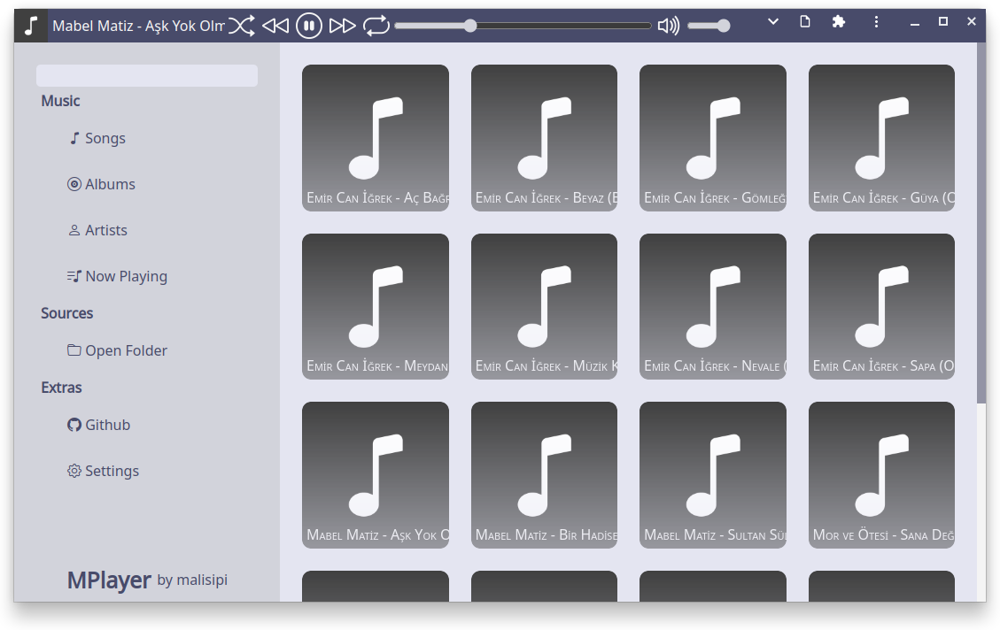

# MPlayer

A music player that works on your browser. You can [try it](https://malisipi.github.io/MPlayer/) now!

> Supports Chrome, Edge, Opera, Firefox, Safari

## APIs Used by MPlayer

|API|Chrome|Edge|Firefox|Opera|Safari|
|-|-|-|-|-|-|
| [Notifications API](https://developer.mozilla.org/en-US/docs/Web/API/Notifications_API)* | 20 | 14 | 22 | 23 | 7 |
| [IndexedDB API](https://developer.mozilla.org/en-US/docs/Web/API/IndexedDB_API)* | 24 | 12 | 16 | 15 | 8 |
| [AudioContext API](https://developer.mozilla.org/en-US/docs/Web/API/AudioContext) | 35 | 12 | 25 | 22 | 14.1 |
| [Fetch API](https://developer.mozilla.org/en-US/docs/Web/API/Fetch_API) | 42 | 14 | 39 | 29 | 10.1 |
| [File System Access API](https://developer.mozilla.org/en-US/docs/Web/API/File_System_Access_API) | 86 | 86 | x | 72 | 15.2 |
| \\\-\-[Window.showDirectoryPicker()](https://developer.mozilla.org/en-US/docs/Web/API/Window/showDirectoryPicker) | 86 | 86 | x | 72 | x |
| [Window Controls Overlay API](https://developer.mozilla.org/en-US/docs/Web/API/Window_Controls_Overlay_API)* | 105 | 105 | x | 91 | x |
| [Media Session API](https://developer.mozilla.org/en-US/docs/Web/API/Media_Session_API)* | 73 | 79 | 82 | 60 | 15 |

> \*: Optional (For Extended Functionality)

## License of MPlayer

> MPlayer (this project) licensed by [MPL 2.0](./LICENSE) .

## Projects Used by MPlayer

* [MusicMetadata](https://github.com/leetreveil/musicmetadata) - MIT License
* [Bootstrap Icons](https://icons.getbootstrap.com/) - MIT License
* [Noto Sans](https://fonts.google.com/noto/specimen/Noto+Sans) - OFL License
* [IDB Keyval](https://github.com/jakearchibald/idb-keyval)
* [Native File System adapter (ponyfill)](https://github.com/jimmywarting/native-file-system-adapter) - MIT License
    > To support old browsers that doesn't have window.showDirectoryPicker function
* [Vebview.JS](https://github.com/malisipi/Vebview.JS) - Apache 2.0 License
